<div align="center">

# ReSee

### 저장하고 잊어버리는 콘텐츠를 다시 꺼내 쓰는 AI 스마트 아카이브

SNS 링크와 스크린샷을 저장하면 **콘텐츠 수집 → OCR/파싱 → AI 요약·분류 → 개인 아카이빙 → 다시 보기**까지 하나의 흐름으로 연결합니다.

**2026 Dankook University Capstone Design · Team Re:Mind**  
**초기 2인 팀 프로젝트 · 현재 김재훈 단독 개발 및 유지보수 · 2026.03 ~ 현재**

</div>

---

## Demo

<div align="center">
  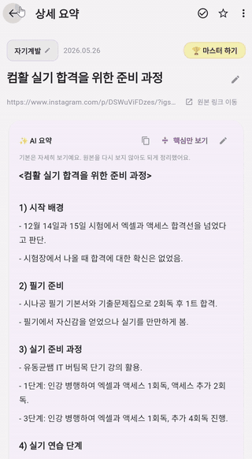
</div>

> 별도 배포 URL은 없으며, 현재는 로컬 환경에서 실행할 수 있습니다.

---

## Project Overview

유용한 SNS 게시물이나 웹 콘텐츠를 저장해두고도 다시 열어보지 않는 **'저장 후 방치' 문제**를 해결하기 위해 만든 스마트 아카이브 서비스입니다.

ReSee는 Instagram·웹 링크와 여러 장의 스크린샷을 입력받아 콘텐츠를 수집하고, AI가 핵심 내용을 정리해 **상세 요약과 핵심 요약**으로 제공합니다. 분석된 콘텐츠는 사용자별 아카이브에 저장되며, 검색·즐겨찾기·고정·컬렉션·카테고리 관리·휴지통 등으로 다시 활용할 수 있습니다.

### User Flow

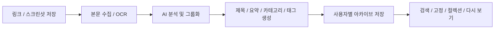

---

## Main Features

### 1. 링크·이미지 기반 콘텐츠 수집

- 일반 웹 페이지 및 Instagram 링크 분석
- 여러 장의 스크린샷 동시 업로드
- URL과 이미지를 함께 입력하는 복합 분석
- 업로드 이미지 원본 보존 및 상세 화면에서 확인

### 2. AI 기반 요약·분류

- 이미지 OCR과 언어 요약을 분리한 **Dual-Pass AI Pipeline**
- 상세 화면용 `summary`와 빠른 확인용 `shortSummary` 제공
- 콘텐츠에 맞는 카테고리 및 태그 생성
- 여러 스크린샷을 게시물 단위로 자동 묶는 **Smart Grouping**
- AI 가공 결과와 별도로 원문 텍스트를 보존해 결과 대조 가능

### 3. 개인화 아카이브

- Firebase Authentication 기반 로그인/회원가입
- 사용자 UID를 기준으로 개인별 콘텐츠 분리
- 저장한 콘텐츠를 아카이브에서 카테고리별로 관리
- 즐겨찾기, 읽음/완료, 고정, 컬렉션 등 콘텐츠 상태 관리

### 4. 다시 보게 만드는 UX

- 홈 화면의 **내가 고정한 카드** 영역
- 아직 확인하지 않은 콘텐츠를 알려주는 **놓친 요약** 배너
- 제목·요약·메모를 다시 찾을 수 있는 통합 검색
- 사용자 직접 카테고리 생성·수정·정렬
- 다중 선택 삭제와 휴지통 복구/완전 삭제
- 닉네임 변경 및 개인화된 홈 화면

---

## Screenshots

### 저장 → AI 분석 → 다시 보기

<table>
  <tr>
    <td align="center"><b>Home</b></td>
    <td align="center"><b>Add Content</b></td>
    <td align="center"><b>AI Detail</b></td>
    <td align="center"><b>Short Summary</b></td>
  </tr>
  <tr>
    <td>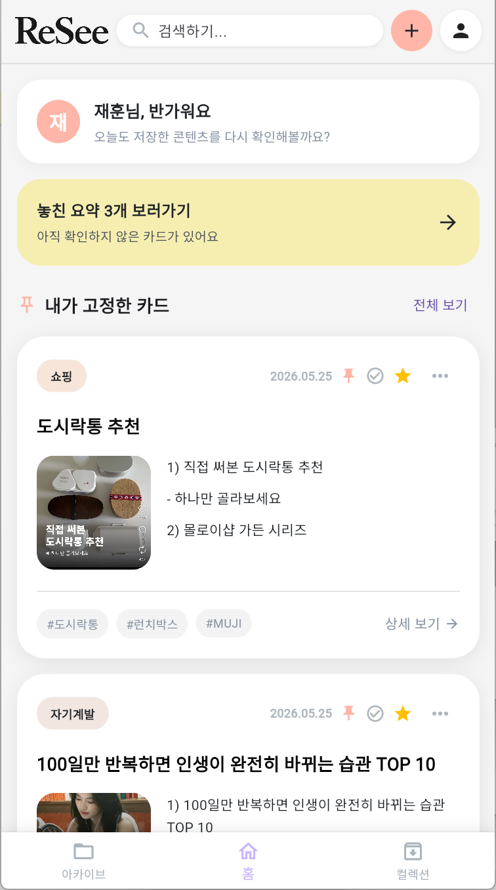</td>
    <td>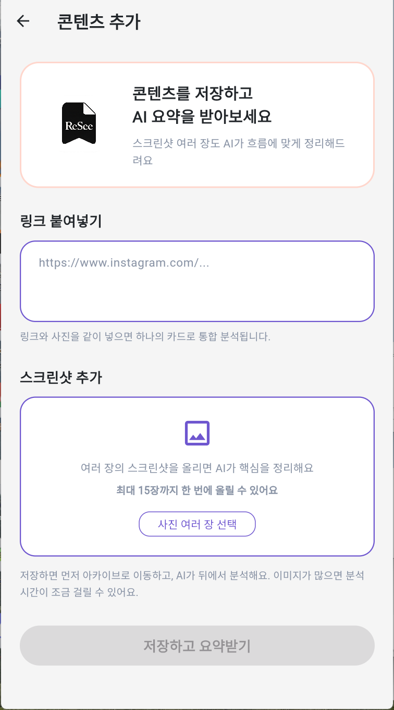</td>
    <td>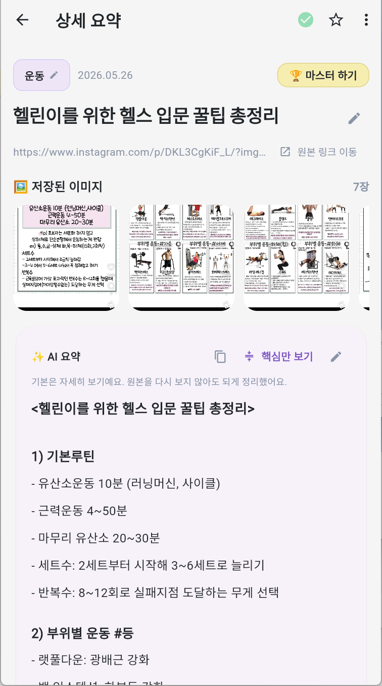</td>
    <td>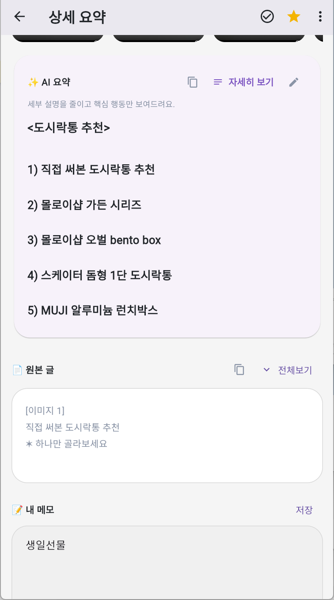</td>
  </tr>
</table>

### 저장한 정보를 관리하는 기능

<table>
  <tr>
    <td align="center"><b>Archive</b></td>
    <td align="center"><b>Collection</b></td>
    <td align="center"><b>Search</b></td>
    <td align="center"><b>Category</b></td>
  </tr>
  <tr>
    <td>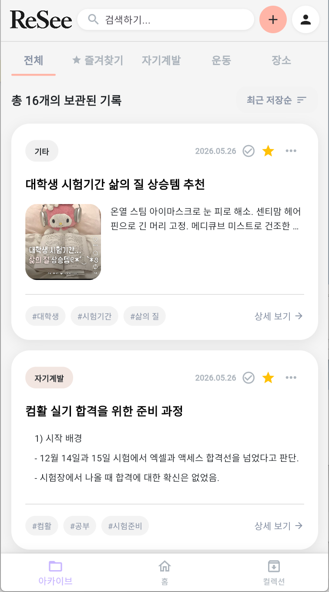</td>
    <td>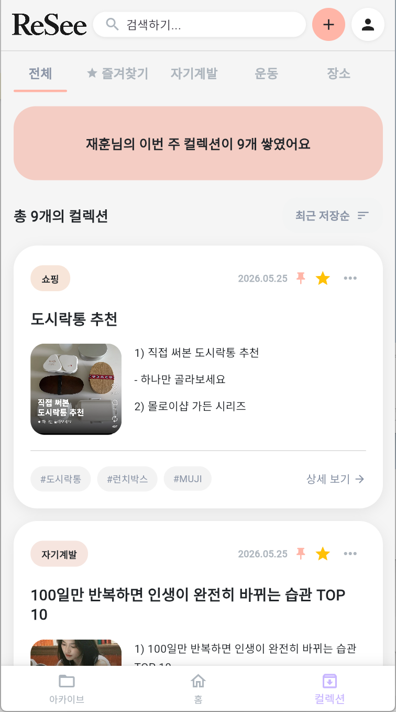</td>
    <td>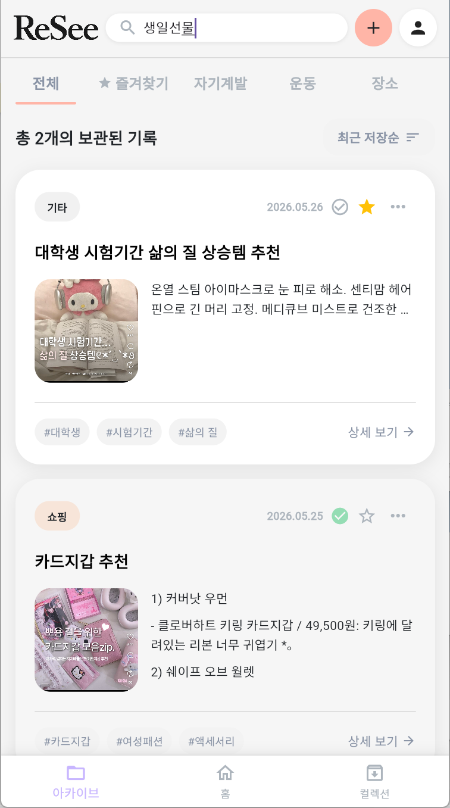</td>
    <td>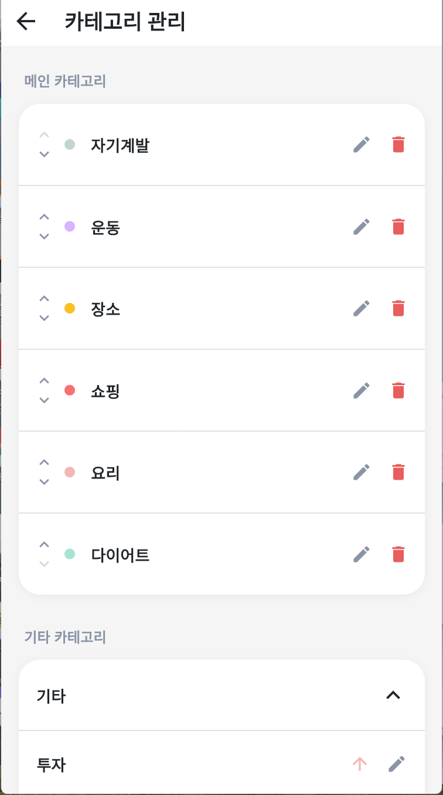</td>
  </tr>
</table>

### 리마인드·개인화·생명주기 관리

<table>
  <tr>
    <td align="center"><b>Pinned Cards</b></td>
    <td align="center"><b>Missed Summaries</b></td>
    <td align="center"><b>Trash</b></td>
    <td align="center"><b>Account</b></td>
  </tr>
  <tr>
    <td>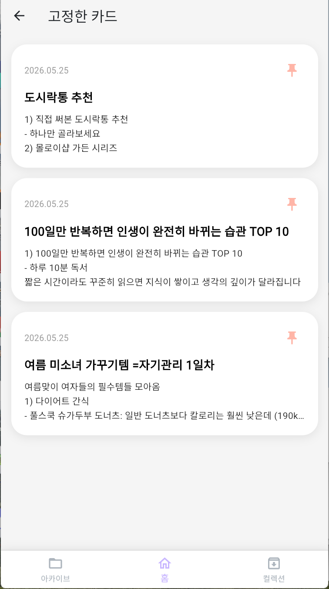</td>
    <td>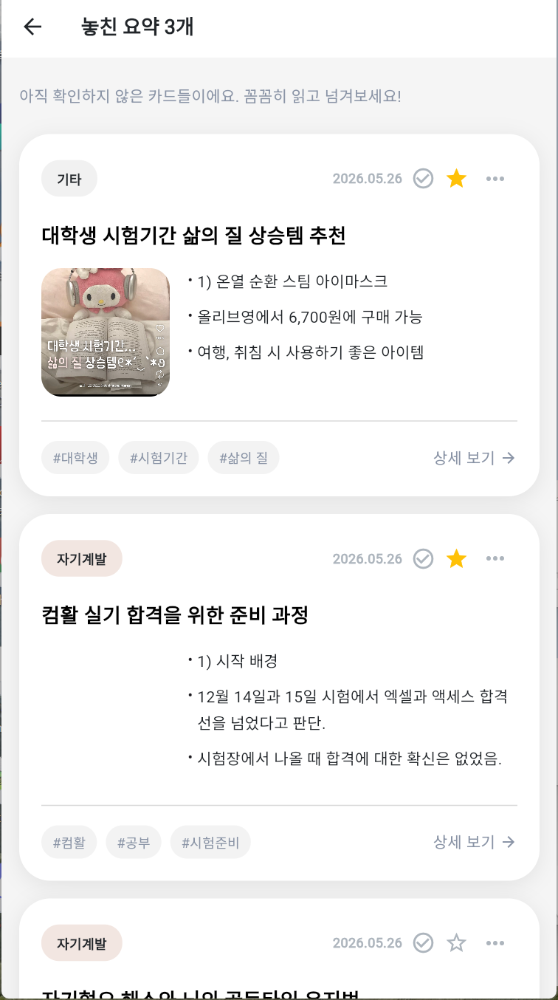</td>
    <td>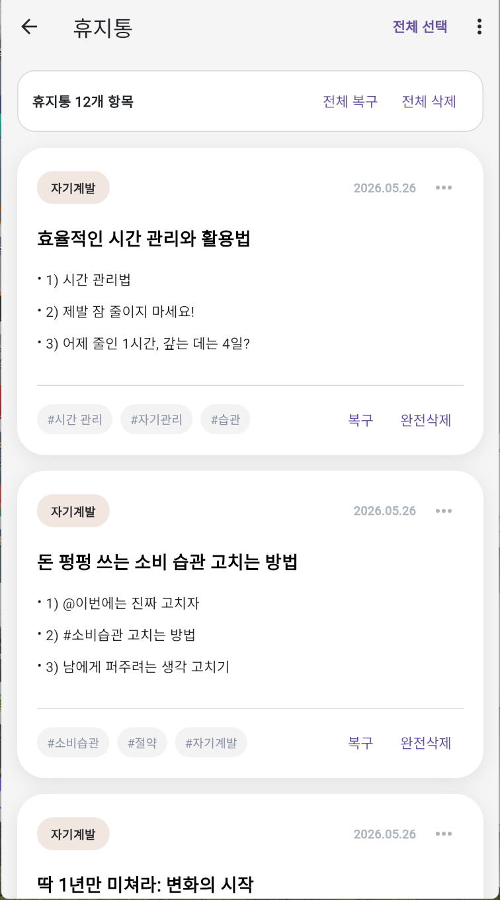</td>
    <td>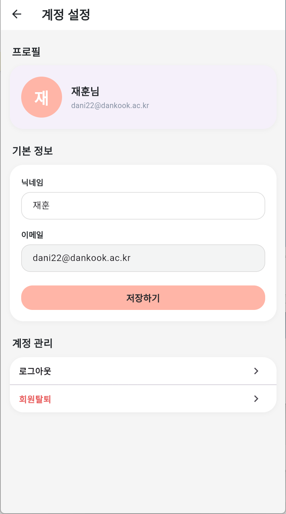</td>
  </tr>
</table>

---

## System Architecture

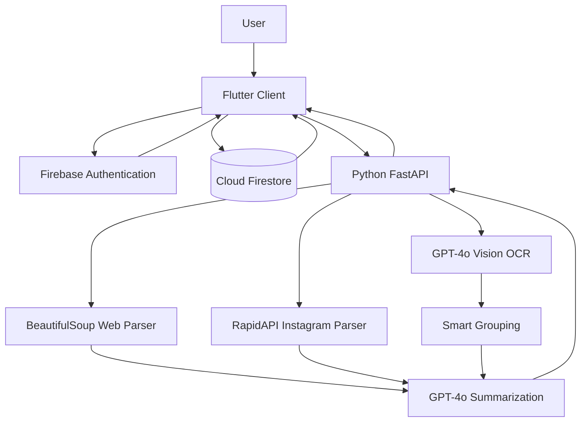

### Data Flow

1. 사용자가 링크 또는 스크린샷을 등록합니다.
2. FastAPI 서버가 입력 형태에 따라 웹 파싱 또는 이미지 OCR을 수행합니다.
3. 다중 이미지 입력은 게시물 단위로 그룹화합니다.
4. 수집된 원문을 AI가 `title`, `summary`, `shortSummary`, `category`, `tags` 구조로 정리합니다.
5. Flutter 클라이언트가 결과를 받아 사용자 UID 기준 Firestore 데이터로 저장·관리합니다.
6. 사용자는 아카이브, 검색, 고정, 컬렉션, 휴지통 등을 통해 저장한 콘텐츠를 다시 활용합니다.

---

## Core Implementation

ReSee는 초기 개발 단계에서 **Flutter/Firebase 기반 사용자 서비스 영역**과 **FastAPI/LLM 기반 AI 분석 영역**을 분담하여 개발했습니다. 현재는 김재훈이 전체 프로젝트의 후속 개발과 유지보수를 단독으로 진행하고 있습니다.

### Frontend · UX · Firebase — 박지민 (초기 구현)

#### Flutter 기반 서비스 UI/UX

- 홈, 아카이브, 컬렉션, 상세 요약, 콘텐츠 추가, 계정 설정 등 주요 화면 구현
- 링크 입력과 다중 이미지 업로드를 하나의 콘텐츠 저장 흐름으로 연결
- AI 분석 결과를 카드 UI와 상세 화면에 맞게 표시
- `summary` / `shortSummary` 전환을 통해 같은 콘텐츠를 두 가지 깊이로 확인할 수 있는 UX 구현

#### Firebase 기반 사용자별 저장 구조

- Firebase Authentication을 활용한 로그인/회원가입
- 로그인 상태에 따른 화면 분기 및 사용자 세션 처리
- Firestore 저장 시 사용자 UID를 함께 관리해 **사용자별 콘텐츠 분리 조회 구조** 구현
- 콘텐츠의 읽음/완료, 즐겨찾기, 고정, 컬렉션, 삭제 상태 등을 앱 화면과 연결

#### 콘텐츠 관리 UX

- **내가 고정한 카드**: 중요한 콘텐츠를 홈에서 바로 다시 확인
- **놓친 요약**: 아직 확인하지 않은 콘텐츠 개수를 홈에서 리마인드
- **통합 검색**: 저장된 제목·요약·메모를 기반으로 탐색
- **카테고리 관리**: 카테고리 생성·수정·정렬 및 사용자 맞춤 분류
- **생명주기 관리**: 다중 선택 삭제, 휴지통 이동, 복구, 완전 삭제
- 계정 설정에서 닉네임을 수정하고 개인화된 화면에 반영

### AI Backend · Data Pipeline — 김재훈

#### Dual-Pass AI Pipeline

멀티모달 모델에 이미지 분석과 요약을 한 번에 맡길 때 발생할 수 있는 누락·환각을 줄이기 위해 **시각 정보 추출과 언어적 요약을 분리**했습니다.

**Pass 1 — OCR / Metadata Extraction**

`extract_image_text()`에서 GPT-4o Vision을 이용해 화면에 실제로 보이는 텍스트와 함께 다음 메타데이터를 구조화합니다.

- `sourceAccount`: 게시물 작성 계정
- `carouselInfo`: 슬라이드 순서
- `captionSnippet`: 캡션 일부
- `platformHint`, `confidence` 등 분석용 정보

**Pass 2 — Structured Summarization**

`call_summary_ai()`는 추출 결과를 바탕으로 화면에서 바로 사용할 수 있는 JSON을 생성합니다.

```json
{
  "title": "콘텐츠 제목",
  "summary": "자세히 보기용 전체 정리",
  "shortSummary": "핵심만 보기용 압축 정리",
  "category": "카테고리",
  "tags": ["태그1", "태그2", "태그3"]
}
```

프롬프트에서는 원문 구조 보존, SNS 행동 유도 문구 제거, 원문에 없는 내용 생성 금지 등을 명시하고 JSON response format으로 결과 스키마를 고정했습니다.

#### Async Multi-Image Processing

다수 이미지 업로드 시 순차 OCR로 인한 병목을 줄이기 위해 비동기 처리 구조를 적용했습니다.

```python
semaphore = asyncio.Semaphore(OCR_PARALLEL_LIMIT)  # 8
results = await asyncio.gather(*tasks)
```

- 최대 **8개 이미지 동시 OCR 처리**
- `asyncio.to_thread()`로 동기 AI 호출을 이벤트 루프와 분리
- 처리 완료 순서와 관계없이 원본 이미지 순서를 복원

#### Smart Grouping Engine

`/analyze/image-groups`에서 여러 스크린샷의 `sourceAccount`, `captionSnippet`, `carouselInfo` 등을 비교해 **같은 게시물끼리 자동으로 카드 단위 그룹화**합니다.

- 게시물 작성 계정과 캡션을 우선 기준으로 그룹 판단
- Carousel 번호를 활용해 연속 이미지 식별
- `imageIndexes`로 원본 이미지와 그룹 결과 연결
- 모델이 이미지를 누락했을 경우 미배정 인덱스를 탐지하고 보정

#### Robust Parsing & Preprocessing

- Naver Blog 본문 접근을 위해 `PostView.naver` 경로와 본문 컨테이너를 파싱
- Instagram 게시물·릴스 데이터는 RapidAPI를 통해 수집
- 일반 웹 페이지는 BeautifulSoup 기반으로 본문 텍스트 추출
- 긴 텍스트는 `CHUNK_SIZE = 9000` 단위로 나눈 뒤 부분 요약 → 재통합 → 최종 요약
- 좋아요·팔로우·댓글·프로필 링크 등 SNS 노이즈 제거
- 번호형 목록, 체크리스트, 시간·용량·조건 등 정보 구조를 가능한 한 유지

---

## API Design

| Method | Endpoint | Description |
|---|---|---|
| `POST` | `/analyze` | URL 콘텐츠 분석 |
| `POST` | `/analyze/image` | 다중 이미지 OCR 및 분석 |
| `POST` | `/analyze/image-groups` | 여러 스크린샷을 게시물 단위로 그룹화 후 분석 |
| `POST` | `/analyze/complex` | URL + 이미지 복합 분석 |
| `GET` | `/` | Health check |

---

## Tech Stack

| Area | Stack |
|---|---|
| Frontend | Flutter, Dart |
| Authentication | Firebase Authentication |
| Database | Cloud Firestore |
| AI Backend | Python, FastAPI, Uvicorn |
| AI / Vision | OpenAI GPT-4o, GPT-4o-mini |
| Crawling / Parsing | BeautifulSoup, Requests, RapidAPI |
| Async Processing | `asyncio`, `Semaphore`, `gather`, `to_thread` |

---

## Development & Contributions

| Member | Role | Main Responsibilities |
|---|---|---|
| **박지민** · [@jimin-21](https://github.com/jimin-21) | 초기 개발 · Frontend · UI/UX · Firebase | Flutter 화면 및 인터랙션, Firebase Auth, Firestore 연동, 콘텐츠 관리 UX |
| **김재훈** · [@edd1e-kim](https://github.com/edd1e-kim) | 초기 개발 · AI Backend · 현재 Maintainer | FastAPI, OCR, AI 요약, 비동기 이미지 처리, Smart Grouping, 웹/SNS 파싱 및 현재 프로젝트 후속 개발·유지보수 |

> 초기 개발에서는 두 영역을 **Flutter에서 입력한 콘텐츠가 FastAPI 분석 서버를 거쳐 구조화되고 다시 사용자별 Firestore 아카이브로 저장되는 하나의 서비스 흐름**으로 통합했습니다. 현재는 김재훈이 전체 코드베이스를 관리하며 졸업작품으로 후속 개발을 이어가고 있습니다.

---

## Development Timeline

**2026.03 ~ 2026.05 · 초기 2인 팀 개발 (총 7주, 3주 차 ~ 9주 차)**  
**2026.09 ~ 현재 · 김재훈 단독 후속 개발 및 유지보수**

| Stage | Frontend / Firebase | AI Backend / Data Pipeline |
|---|---|---|
| 착수 | 프로젝트 환경 및 데이터 구조 설계 | AI 라이브러리·모델 분석 |
| 구현 I | 기본 화면, 홈/아카이브 UI | 웹/SNS 콘텐츠 수집 파이프라인 |
| 구현 II | 상세 화면, 메모·저장 기능 | LLM 요약 프롬프트 설계 및 테스트 |
| 통합 | 클라이언트와 API 연결 | FastAPI 서버 및 분석 API 연동 |
| 테스트 | 전체 사용자 흐름 QA | 요약 품질·응답 처리 안정화 |
| 고도화 | 개인화, 검색, 카테고리, 생명주기 UX | Multi-image OCR, Grouping, 요약·전처리 고도화 |
| 마무리 | 최종 UI 및 시연 준비 | 기술 정리 및 최종 시연 연동 |
| 현재 | 전체 코드베이스 점검 및 후속 개발 | 졸업작품을 위한 유지보수 및 기능 고도화 진행 |

---

## Local Setup

### AI Backend

#### 1. Required API Keys

- OpenAI API Key
- RapidAPI Key (`instagram-scraper-stable-api`)

#### 2. Environment Variables

`main.py`와 같은 디렉터리에 `.env` 파일을 생성합니다.

```env
OPENAI_API_KEY=your_openai_api_key
RAPIDAPI_KEY=your_rapidapi_key
```


#### 3. Python Environment

```bash
python -m venv venv
```

**Windows**

```bash
venv\Scripts\activate
```

**macOS / Linux**

```bash
source venv/bin/activate
```

```bash
pip install fastapi uvicorn python-multipart python-dotenv openai requests beautifulsoup4
```

#### 4. Run FastAPI

```bash
uvicorn main:app --reload --host 0.0.0.0 --port 8000
```

- Health Check: `http://127.0.0.1:8000/`
- Swagger UI: `http://127.0.0.1:8000/docs`

정상 실행 시:

```json
{"status":"ok"}
```

### Flutter Client Connection

- Android Emulator → `http://10.0.2.2:8000`
- Flutter Web → `http://127.0.0.1:8000`


---

## Project Result

ReSee는 단순한 북마크 저장 기능을 넘어서, **수집한 정보를 AI로 구조화하고 다시 확인하도록 유도하는 개인 지식 아카이브**를 구현하는 것을 목표로 했습니다.

초기 팀 개발을 통해 다음 흐름을 하나의 애플리케이션으로 통합했습니다.

**콘텐츠 입력 → 외부 데이터 수집/OCR → AI 분석 → 구조화된 결과 → 사용자별 저장 → 검색·리마인드·생명주기 관리**

현재 캡스톤 프로토타입을 기반으로 김재훈이 졸업작품을 위한 후속 개발과 유지보수를 단독으로 진행하고 있으며, 별도의 공개 배포 URL은 제공하지 않습니다.
